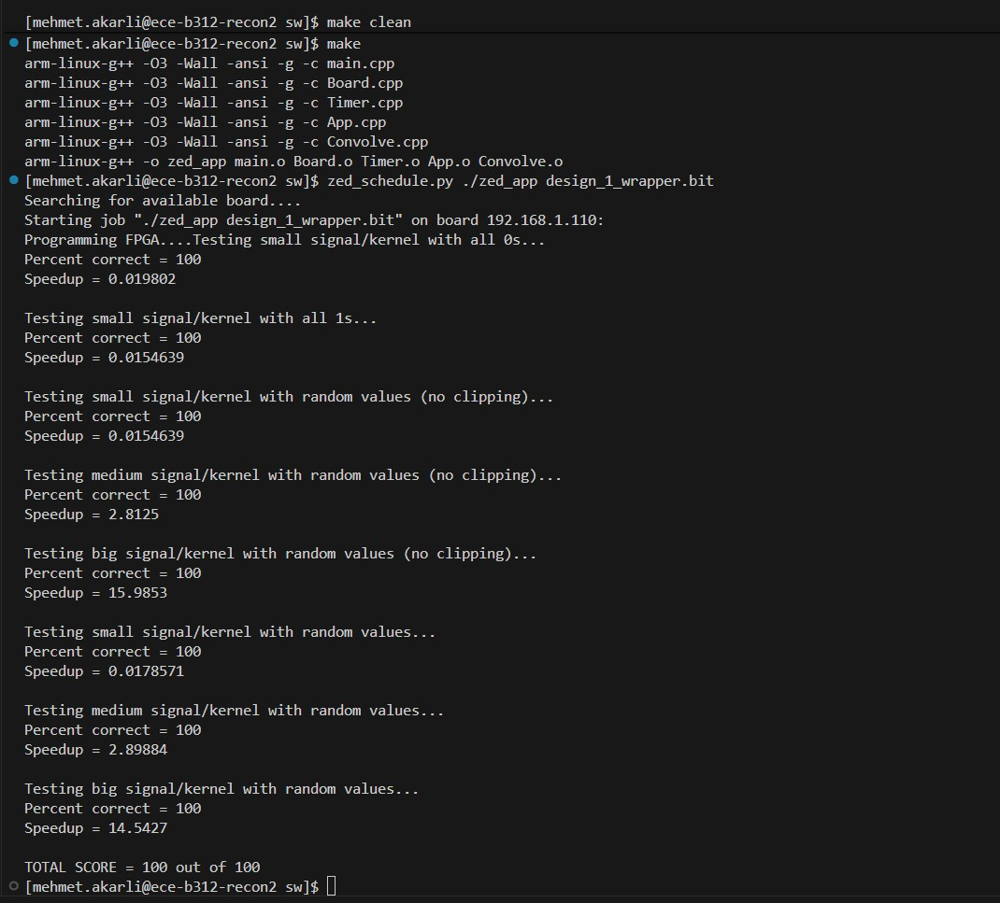

# FPGA 1D Convolution Accelerator (Course Project)

University FPGA/SoC project focused on **RTL integration, verification, and system bring-up** of a streaming 1D convolution accelerator.

**Note:** The convolution compute pipeline + DMA/register infrastructure were provided by the course.  
My work focuses on the **buffers, control logic, MMIO behavior, verification, and full system integration** around that pipeline.

## Results
End-to-end validation on the target FPGA: built the bitstream and ran the provided C++ host test (via PuTTY/SSH) to program the board and verify functional correctness (**100% correctness on multiple test cases**).

## What I implemented
### RTL / Control / Integration
- Signal buffer with sliding-window support
- Kernel buffer for coefficient loading
- Valid/ready handshaking between blocks
- Delay alignment + clipping/saturation logic
- Top-level control logic (`user_app`): reset/clear/start/stop sequencing
- MMIO control behavior connected to hardware state
- Integrated provided blocks (DMA + pipeline) with custom RTL

### Verification
- Wrote VHDL testbenches for:
  - signal buffer
  - kernel buffer
  - top-level `user_app`
- Waveform-driven debug to verify data ordering, alignment, and control timing

## Provided by the course (unchanged)
- Convolution pipeline (multiply–add)
- DMA/DRAM read + write blocks
- Register-map infrastructure + wrappers  
(Kept in `provided/` for clarity.)

## Repo structure
- `user_app/` top-level integration + control
- `buffers/` custom RTL blocks (signal/kernel buffers, delay, clipping)
- `testbench/` VHDL testbenches
- `provided/` course-provided modules (unchanged)
- `docs/` original course description

## Tools
- VHDL
- Xilinx Vivado (simulation + synthesis + implementation)
- Memory-mapped control (MMIO)
- Streaming datapath with valid/ready handshaking
